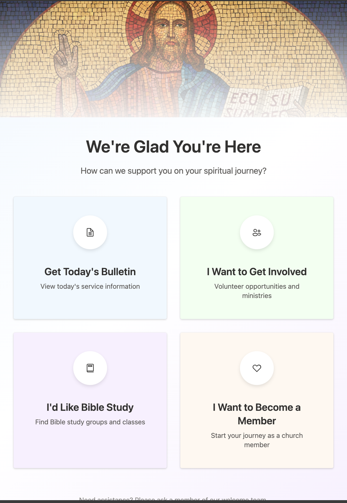

  # Kiosk Web App Design

  This is a Kiosk web application designed to run on the Apple iPad.
  The use is for a church sign up kiosk. 

  # Setps to turn your iPad into a kiosk (one way)

  > Settings -> Accessibility -> Guided Access
  - Set a password
  - triple click the home button to turn on
  - indicate what parts of the screen are not clickable

  
 
  ## Running the code

  Run `npm i` to install the dependencies.

  Run `npm run dev` to start the development server.
  